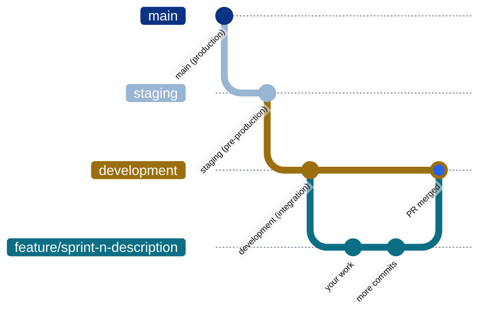

# 📝 Contributing

This is a data engineering pipeline — no frontend code. Contributing means adding data sources, building parsers and loaders, extending dbt models, or onboarding new analytical domains.

---

## ⚙️ Development Setup

### Prerequisites

- Python 3.11+ (via [pyenv](https://github.com/pyenv/pyenv) recommended)
- Docker + Docker Compose

### Initial Setup

```bash
git clone <repo-url> && cd app-personal-portfolio-dataflow

make setup        # Creates .venv, installs deps, copies .env.example → .env
make docker-up    # Start PostgreSQL 16 + PostGIS 3.4
make db-init      # Create all schemas and tables
make load-toronto # Load Toronto data from APIs
make dbt-run      # Run all dbt transformations
make dbt-test     # Validate output
```

### Useful Commands

```bash
make test        # pytest
make lint        # ruff linter
make format      # ruff formatter
make typecheck   # mypy (strict)
make ci          # lint + typecheck + test
make dbt-run     # Run all dbt models
make dbt-test    # Run all dbt tests
make pgweb-up    # Browse database at http://localhost:8081
```

---

## 🏗️ Branch Workflow



```bash
# Always start from development
git checkout development && git pull origin development

# Create feature branch (use gitflow plugin)
# /gitflow branch-start

# Work, commit with conventional commits
# /gitflow commit

# Push and open PR to development
git push -u origin feature/sprint-n-description
```

| Rule | Detail |
|------|--------|
| Never commit directly to | `main`, `staging`, or `development` |
| Feature branches | Temporary — delete after merge |
| Commits | Use `/gitflow commit` for conventional commit messages |
| PR target | Always merge to `development` |

---

## 🧪 Testing

### Before Every Commit

```bash
# 1. Run quality checks
make ci           # lint + typecheck + test

# 2. Validate dbt project syntax
cd dbt && .venv/bin/dbt parse --profiles-dir .

# 3. Run affected dbt models and tests
make dbt-run
make dbt-test
```

### dbt Mandatory Rules

| Rule | Why |
|------|-----|
| Always `dbt parse` before `dbt run` | Catches model errors early, prevents silent failures |
| Never rename mart columns without coordinating with the webapp | Marts are the contract — breaking them breaks production |
| Run `dbt test` after any model change | Validates assumptions and FK relationships |
| Check downstream impact before editing | `dbt run --select +<changed_model>+` |

---

## 📊 Code Standards

### Type Hints — Python 3.10+ syntax

```python
def load_records(records: list[NewRecord], dry_run: bool = False) -> int: ...
def parse_value(raw: str | None) -> float | None: ...
```

### Import Style

| Context | Style | Example |
|---------|-------|---------|
| Same directory | Single dot | `from .neighbourhood import NeighbourhoodRecord` |
| Sibling directory | Double dot | `from ..schemas.neighbourhood import CensusRecord` |
| External packages | Absolute | `import pandas as pd` |

### SQLAlchemy 2.0 Style

```python
# ✅ Correct (2.0 mapped_column)
class FactNewData(Base):
    id: Mapped[int] = mapped_column(Integer, primary_key=True, autoincrement=True)
    neighbourhood_id: Mapped[int] = mapped_column(Integer, nullable=False)
    value: Mapped[float | None] = mapped_column(Numeric(10, 2), nullable=True)

# ❌ Incorrect (legacy 1.x Column style)
# id = Column(Integer, primary_key=True)
```

### Pydantic 2.0 Style

```python
# ✅ Correct (2.0 field_validator)
@field_validator("year")
@classmethod
def validate_year(cls, v: int) -> int:
    if v < 2000:
        raise ValueError(f"Year {v} out of range")
    return v

# ❌ Incorrect (legacy 1.x @validator)
# @validator("year")
```

### Error Handling

```python
from dataflow.errors.exceptions import ParseError, LoadError

def fetch_data(url: str) -> list[dict]:
    try:
        response = httpx.get(url, timeout=30)
        response.raise_for_status()
    except httpx.HTTPError as e:
        raise ParseError(f"Failed to fetch {url}: {e}") from e
```

---

## 🗄️ SQL Style Guide (dbt models)

### General Structure

```sql
-- Always use CTEs, never subqueries
with source as (
    select * from {{ source('raw_toronto', 'fact_census') }}
),

renamed as (
    select
        neighbourhood_id,
        census_year,
        population::integer          as population,
        median_household_income::numeric(12, 2) as median_household_income
    from source
    where neighbourhood_id is not null
)

select * from renamed
```

### Naming

| Pattern | Example |
|---------|---------|
| Source CTE | `source`, `raw` |
| Transformation CTE | descriptive verb (`renamed`, `pivoted`, `joined`) |
| Final CTE | `final` or descriptive |
| Column aliases | `snake_case`, always explicit for computed columns |

### Layer Responsibilities

| Layer | Rule |
|-------|------|
| `stg_*` | 1:1 cleaning only — no business logic, no joins across sources |
| `int_*` | Business logic, joins, aggregations. Prefer `int_neighbourhood__foundation` as base |
| `mart_*` | Final, documented, stable contracts. Geometry via JOIN to `mart_neighbourhood_geometry` |

---

## 📦 Adding a New Domain

For a complete guide to adding a new data domain (new DB schema + ETL + dbt stack), see the runbook:

**→ [docs/runbooks/adding-domain.md](docs/runbooks/adding-domain.md)**

Summary of the 7-step process:

1. Create Python package (`dataflow/<domain>/`)
2. Write Pydantic schemas
3. Define SQLAlchemy models
4. Write parsers (API / file extraction)
5. Write loaders (DB persistence)
6. Create dbt staging → intermediate → mart models
7. Write tests and register ETL script

> **Webapp integration is separate.** Once mart tables are deployed, the webapp team integrates via read-only queries. See the webapp repo for that workflow.

---

## 📝 Commit Conventions

This project uses [Conventional Commits](https://www.conventionalcommits.org/):

| Type | Use For |
|------|---------|
| `feat:` | New feature, new data source, new dbt model |
| `fix:` | Bug fix, data correction |
| `refactor:` | Code restructure without behavior change |
| `docs:` | Documentation only |
| `chore:` | Build, deps, config updates |
| `test:` | Adding or updating tests |

Use `/gitflow commit` to auto-generate compliant messages.

---

## 🔗 References

| Resource | Link |
|----------|------|
| Code conventions + AI context | [CLAUDE.md](CLAUDE.md) |
| Adding a new domain | [docs/runbooks/adding-domain.md](docs/runbooks/adding-domain.md) |
| Database schema reference | [docs/DATABASE_SCHEMA.md](docs/DATABASE_SCHEMA.md) |
| VPS deployment | [docs/deployment/vps-deployment.md](docs/deployment/vps-deployment.md) |
| Root README | [README.md](README.md) |

---

*Contributing guide · app-personal-portfolio-dataflow · Data pipeline only*
