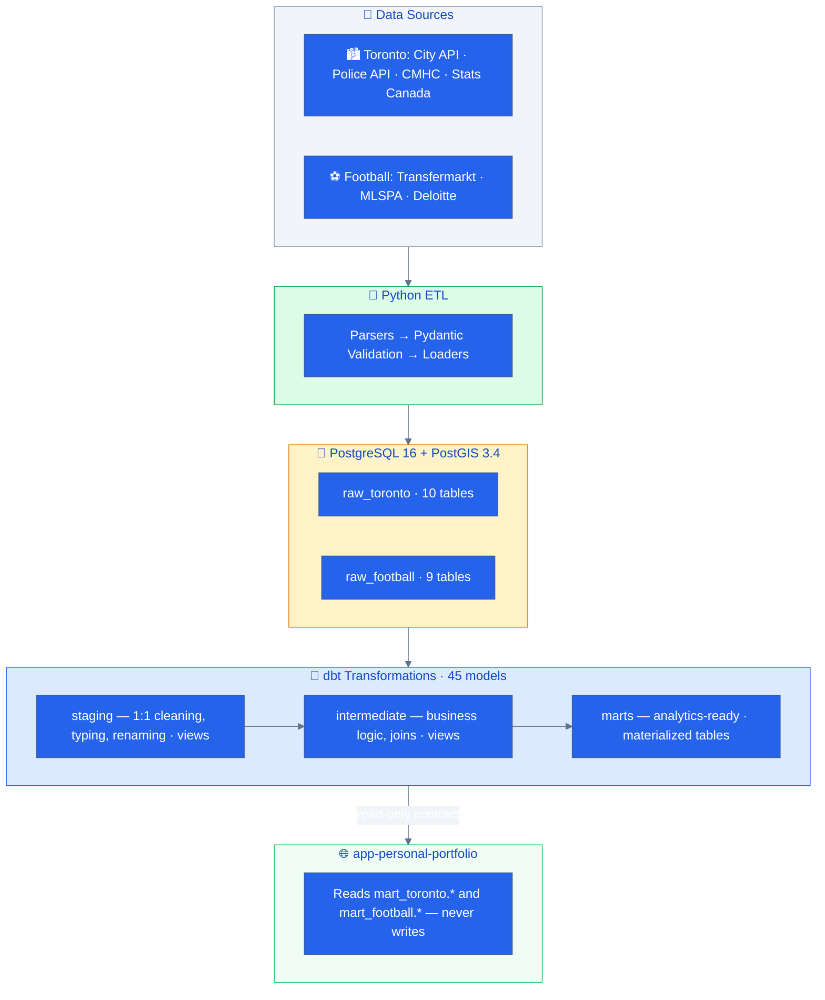

# Portfolio Dataflow


> **Production-grade ELT pipeline for the [leodata.science](https://leodata.science) analytics portfolio.**
> Two domains. Six sources. 45 dbt models. One clean data contract.

Raw data in. Analytics-ready mart tables out. No frontend code here.

---

## 📋 Overview

This repository is the **data backbone** of the leodata.science portfolio. It implements a full ELT pipeline across two analytical domains:

| Step | Technology | What Happens |
|------|-----------|--------------|
| **Extract** | Python + httpx | Public APIs, open datasets, PDF reports, Wikipedia scrapes |
| **Load** | SQLAlchemy 2.0 + Pydantic 2.0 | Validated records persisted to PostgreSQL/PostGIS |
| **Transform** | dbt 1.9 | Raw → staging → intermediate → analytical marts |

The mart tables are the **stable, read-only contract** consumed by the [portfolio webapp](https://gitea.hotserv.cloud/personal-projects/personal-portfolio).

---

## 🚀 Quick Start

```bash
# 1. Clone and install
git clone <repo-url> && cd app-personal-portfolio-dataflow
make setup          # Creates .venv, installs deps, initialises pre-commit

# 2. Start the full dev environment (database + pgweb browser at http://localhost:8081)
make local-dev      # docker-up + db-init + pgweb — one command for everything

# 3. Load data and run transformations
make load-data      # Run Toronto + Football ETL pipelines
make dbt-run        # staging → intermediate → marts
make dbt-test       # Run all 126 dbt tests
```

> **Tip:** `make local-dev` is the recommended dev mode — it starts PostgreSQL, initialises the schema, and launches the [pgweb](http://localhost:8081) database browser in one step. Use `make docker-up` alone if you don't need pgweb.

> **ARM64:** This project targets Raspberry Pi 4 (arm64). Uses `imresamu/postgis:16-3.4` for ARM64 compatibility.

---

## 🏗️ Project Structure

```
app-personal-portfolio-dataflow/
├── dataflow/                   # Core pipeline package
│   ├── toronto/                # Toronto domain (parsers, loaders, schemas, models)
│   └── football/               # Football domain (parsers, loaders, schemas, models)
├── dbt/                        # dbt project: portfolio
│   └── models/
│       ├── shared/             # Cross-domain dimensions
│       ├── staging/            # 1:1 source cleaning — views
│       │   ├── toronto/        # 9 staging models
│       │   └── football/       # 8 staging models
│       ├── intermediate/       # Business logic & joins — views
│       │   ├── toronto/        # 11 intermediate models
│       │   └── football/       # 4 intermediate models
│       └── marts/              # Analytics-ready tables — materialized
│           ├── toronto/        # 9 mart tables  ← webapp reads here
│           └── football/       # 3 mart tables  ← webapp reads here
├── scripts/
│   ├── db/                     # Schema initialisation (init_schema.py)
│   └── data/                   # ETL orchestrators (load_toronto_data.py, load_football_data.py)
├── data/raw/                   # Static files (CMHC Excel, GeoJSON, football CSV submodules)
├── tests/                      # pytest test suite
├── docs/
│   ├── toronto/README.md       # Toronto domain deep dive
│   ├── football/README.md      # Football domain deep dive
│   ├── deployment/             # VPS deployment runbooks (untouched)
│   └── runbooks/               # Operational runbooks
├── CONTRIBUTING.md
├── CHANGELOG.md
└── Makefile
```

---

## 📦 Data Domains

| Domain | Description | Sources | Raw Tables | dbt Models | Marts |
|--------|-------------|:-------:|:----------:|:----------:|:-----:|
| 🏙️ [**Toronto**](docs/toronto/README.md) | Neighbourhood-level urban analytics — housing, demographics, safety, amenities | 4 | 10 | 21 | 9 |
| ⚽ [**Football**](docs/football/README.md) | Global club financials & market values across 7 top leagues | 3 | 9 | 15 | 3 |

---

## 🗄️ Database Schemas

| Schema | Layer | Managed By | Purpose |
|--------|-------|:----------:|---------|
| `raw_toronto` | Raw | SQLAlchemy | Toronto ingestion — direct from APIs and files |
| `raw_football` | Raw | SQLAlchemy | Football ingestion — Transfermarkt, MLSPA, Deloitte |
| `stg_toronto` | Staging | dbt (views) | 1:1 cleaned + typed Toronto source data |
| `stg_football` | Staging | dbt (views) | 1:1 cleaned + typed football source data |
| `int_toronto` | Intermediate | dbt (views) | Toronto business logic, joins, aggregations |
| `int_football` | Intermediate | dbt (views) | Football squad values, transfer flows, financials |
| `mart_toronto` | **Mart** ✅ | dbt (tables) | Final Toronto analytics — webapp reads here |
| `mart_football` | **Mart** ✅ | dbt (tables) | Final football analytics — webapp reads here |
| `public` | Shared | dbt (views) | Cross-domain time dimension |

> **Contract:** The webapp reads only from `mart_toronto.*` and `mart_football.*`. Column renames or drops are breaking changes — coordinate with the webapp repo before shipping.

---

## ⏰ ETL Schedule

Runs as **cron-based jobs** on the VPS. No persistent service process.

| Job | Frequency | Make Target |
|-----|-----------|-------------|
| Toronto full refresh | Weekly (Sun 02:00) | `make load-toronto && make dbt-run` |
| Football full refresh | Weekly (Sun 03:00) | `make load-football && make dbt-run` |
| Full pipeline + tests | Monthly | `make refresh` |

---

## ⚙️ Make Targets

<details>
<summary>Expand full target list</summary>

| Target | Description |
|--------|-------------|
| `make setup` | Create `.venv`, install deps, init pre-commit |
| `make docker-up` | Start PostgreSQL 16 + PostGIS 3.4 |
| `make docker-down` | Stop containers |
| `make local-dev` | Docker + db-init + pgweb (full dev stack) |
| `make db-init` | Initialise all schemas and tables |
| `make db-reset` | ⚠️ Drop and recreate database (destructive) |
| `make load-toronto` | Run Toronto ETL pipeline (includes dbt) |
| `make load-football` | Run Football ETL pipeline (includes dbt) |
| `make load-data` | Run both ETL pipelines |
| `make refresh` | Full pipeline: load-data + dbt-test |
| `make dbt-run` | Execute all dbt models |
| `make dbt-test` | Run all dbt tests |
| `make dbt-docs` | Generate + serve dbt documentation |
| `make test` | Run pytest |
| `make test-cov` | Run pytest with coverage |
| `make lint` | Run ruff linter |
| `make format` | Run ruff formatter |
| `make typecheck` | Run mypy (strict) |
| `make ci` | Full CI: lint + typecheck + test |
| `make pgweb-up` | Start pgweb DB browser (dev only) |

</details>

---

## 🗺️ Architecture


```mermaid
%%{init: {'theme': 'base', 'themeVariables': {'primaryColor': '#2563eb', 'primaryTextColor': '#fff', 'lineColor': '#64748b', 'secondaryColor': '#f1f5f9'}}}%%
flowchart TB
    subgraph sources["📡 Data Sources"]
        style sources fill:#f1f5f9,stroke:#94a3b8
        S1["🏙️ Toronto: City API · Police API · CMHC · Stats Canada"]
        S2["⚽ Football: Transfermarkt · MLSPA · Deloitte"]
    end

    subgraph etl["🐍 Python ETL"]
        style etl fill:#dcfce7,stroke:#16a34a
        E1["Parsers → Pydantic Validation → Loaders"]
    end

    subgraph db["🐘 PostgreSQL 16 + PostGIS 3.4"]
        style db fill:#fef3c7,stroke:#d97706
        R1["raw_toronto · 10 tables"]
        R2["raw_football · 9 tables"]
    end

    subgraph dbt["🔄 dbt Transformations · 45 models"]
        style dbt fill:#dbeafe,stroke:#2563eb
        D1["staging — 1:1 cleaning, typing, renaming · views"]
        D2["intermediate — business logic, joins · views"]
        D3["marts — analytics-ready · materialized tables"]
    end

    subgraph webapp["🌐 app-personal-portfolio"]
        style webapp fill:#f0fdf4,stroke:#22c55e
        W1["Reads mart_toronto.* and mart_football.* — never writes"]
    end

    sources --> etl
    etl --> db
    db --> dbt
    D1 --> D2 --> D3
    dbt -->|"read-only contract"| webapp
```

---

## 🔗 Links

| Resource | |
|----------|-|
| 🏙️ Toronto domain docs | [docs/toronto/README.md](docs/toronto/README.md) |
| ⚽ Football domain docs | [docs/football/README.md](docs/football/README.md) |
| 🚀 VPS deployment | [docs/deployment/vps-deployment.md](docs/deployment/vps-deployment.md) |
| 🐘 Shared PostgreSQL | [docs/deployment/shared-postgres.md](docs/deployment/shared-postgres.md) |
| 🛠️ Adding a domain | [docs/runbooks/adding-domain.md](docs/runbooks/adding-domain.md) |
| 📝 Contributing | [CONTRIBUTING.md](CONTRIBUTING.md) |
| 📜 Changelog | [CHANGELOG.md](CHANGELOG.md) |
| 🌐 Live portfolio | [leodata.science](https://leodata.science) |

---

*v0.5.0 · Data pipeline only — no frontend · Updated February 2026*
