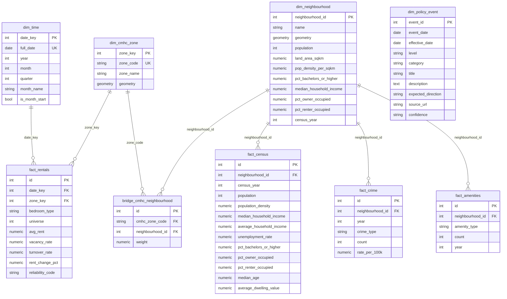

# Database Schema

This document describes the PostgreSQL/PostGIS database schema for the Toronto Neighbourhood Dashboard.

## Entity Relationship Diagram



## Schema Layers

### Database Schemas

| Schema | Purpose | Managed By |
|--------|---------|------------|
| `public` | Shared dimensions (dim_time) | SQLAlchemy |
| `raw_toronto` | Toronto dimension and fact tables | SQLAlchemy |
| `stg_toronto` | Toronto staging models | dbt |
| `int_toronto` | Toronto intermediate models | dbt |
| `mart_toronto` | Toronto analytical tables | dbt |

### Raw Toronto Schema (raw_toronto)

Toronto-specific tables loaded by SQLAlchemy:

| Table | Source | Description |
|-------|--------|-------------|
| `dim_neighbourhood` | City of Toronto API | 158 neighbourhood boundaries |
| `dim_cmhc_zone` | CMHC | ~20 rental market zones |
| `dim_policy_event` | Manual | Policy events for annotation |
| `fact_census` | City of Toronto API | Census profile data |
| `fact_crime` | Toronto Police API | Crime statistics |
| `fact_amenities` | City of Toronto API | Amenity counts |
| `fact_rentals` | CMHC Data Files | Rental market survey data |
| `fact_neighbourhood_profile` | City of Toronto API | Community profile data (immigration, visible minorities, languages, etc.) |
| `bridge_cmhc_neighbourhood` | Computed | Zone-neighbourhood mapping |

### Public Schema

Shared dimensions used across all projects:

| Table | Description |
|-------|-------------|
| `dim_time` | Time dimension (monthly grain) |

### Staging Schema - stg_toronto (dbt)

Staging models provide 1:1 cleaned representations of source data:

| Model | Source Table | Purpose |
|-------|-------------|---------|
| `stg_toronto__neighbourhoods` | raw.neighbourhoods | Cleaned boundaries with standardized names |
| `stg_toronto__census` | raw.census_profiles | Typed census metrics |
| `stg_cmhc__rentals` | raw.cmhc_rentals | Validated rental data |
| `stg_toronto__crime` | raw.crime_data | Standardized crime categories |
| `stg_toronto__amenities` | raw.amenities | Typed amenity counts |
| `stg_dimensions__time` | generated | Time dimension |
| `stg_dimensions__cmhc_zones` | raw.cmhc_zones | CMHC zone boundaries |
| `stg_cmhc__zone_crosswalk` | raw.crosswalk | Zone-neighbourhood mapping |

### Marts Schema - mart_toronto (dbt)

Analytical tables ready for dashboard consumption:

| Model | Grain | Purpose |
|-------|-------|---------|
| `mart_neighbourhood_overview` | neighbourhood | Composite livability scores |
| `mart_neighbourhood_foundation` | neighbourhood × year | Cross-domain scalar indicators (demographics, income, housing costs, labour, education) |
| `mart_neighbourhood_housing` | neighbourhood × year | Housing metrics, profile pivots (dwelling/bedroom/construction), shelter costs, composites |
| `mart_neighbourhood_housing_rentals` | neighbourhood × bedroom_type × year | CMHC rental data disaggregated to neighbourhood grain via area-weighted crosswalk |
| `mart_neighbourhood_safety` | neighbourhood × year | Crime rate calculations |
| `mart_neighbourhood_demographics` | neighbourhood × year | Income, age, population metrics + profile summary columns |
| `mart_neighbourhood_amenities` | neighbourhood | Amenity accessibility scores, commute pivots, car dependency index |
| `mart_neighbourhood_profile` | neighbourhood × category × subcategory | Community profile breakdown (immigration, languages, ethnic origin, visible minorities, etc.) with geometry |

## Table Details

### Dimension Tables

#### dim_time
Time dimension for date-based analysis. Grain: one row per month.

| Column | Type | Constraints | Description |
|--------|------|-------------|-------------|
| date_key | INTEGER | PK | Surrogate key (YYYYMM format) |
| full_date | DATE | UNIQUE, NOT NULL | First day of month |
| year | INTEGER | NOT NULL | Calendar year |
| month | INTEGER | NOT NULL | Month number (1-12) |
| quarter | INTEGER | NOT NULL | Quarter (1-4) |
| month_name | VARCHAR(20) | NOT NULL | Month name |
| is_month_start | BOOLEAN | DEFAULT TRUE | Always true (monthly grain) |

#### dim_cmhc_zone
CMHC rental market zones (~20 zones covering Toronto).

| Column | Type | Constraints | Description |
|--------|------|-------------|-------------|
| zone_key | INTEGER | PK, AUTO | Surrogate key |
| zone_code | VARCHAR(10) | UNIQUE, NOT NULL | CMHC zone identifier |
| zone_name | VARCHAR(100) | NOT NULL | Zone display name |
| geometry | GEOMETRY(POLYGON) | SRID 4326 | PostGIS zone boundary |

#### dim_neighbourhood
Toronto's 158 official neighbourhoods.

| Column | Type | Constraints | Description |
|--------|------|-------------|-------------|
| neighbourhood_id | INTEGER | PK | City-assigned ID |
| name | VARCHAR(100) | NOT NULL | Neighbourhood name |
| geometry | GEOMETRY(POLYGON) | SRID 4326 | PostGIS boundary |
| population | INTEGER | | Total population |
| land_area_sqkm | NUMERIC(10,4) | | Area in km² |
| pop_density_per_sqkm | NUMERIC(10,2) | | Population density |
| pct_bachelors_or_higher | NUMERIC(5,2) | | Education rate |
| median_household_income | NUMERIC(12,2) | | Median income |
| pct_owner_occupied | NUMERIC(5,2) | | Owner occupancy rate |
| pct_renter_occupied | NUMERIC(5,2) | | Renter occupancy rate |
| census_year | INTEGER | DEFAULT 2021 | Census reference year |

#### dim_policy_event
Policy events for time-series annotation (rent control, interest rates, etc.).

| Column | Type | Constraints | Description |
|--------|------|-------------|-------------|
| event_id | INTEGER | PK, AUTO | Surrogate key |
| event_date | DATE | NOT NULL | Announcement date |
| effective_date | DATE | | Implementation date |
| level | VARCHAR(20) | NOT NULL | federal/provincial/municipal |
| category | VARCHAR(20) | NOT NULL | monetary/tax/regulatory/supply/economic |
| title | VARCHAR(200) | NOT NULL | Event title |
| description | TEXT | | Detailed description |
| expected_direction | VARCHAR(10) | NOT NULL | bearish/bullish/neutral |
| source_url | VARCHAR(500) | | Reference link |
| confidence | VARCHAR(10) | DEFAULT 'medium' | high/medium/low |

### Fact Tables

#### fact_rentals
CMHC rental market survey data. Grain: zone × bedroom type × survey date.

| Column | Type | Constraints | Description |
|--------|------|-------------|-------------|
| id | INTEGER | PK, AUTO | Surrogate key |
| date_key | INTEGER | FK → dim_time | Survey date reference |
| zone_key | INTEGER | FK → dim_cmhc_zone | CMHC zone reference |
| bedroom_type | VARCHAR(20) | NOT NULL | bachelor/1-bed/2-bed/3+bed/total |
| universe | INTEGER | | Total rental units |
| avg_rent | NUMERIC(10,2) | | Average rent |
| vacancy_rate | NUMERIC(5,2) | | Vacancy percentage |
| turnover_rate | NUMERIC(5,2) | | Turnover percentage |
| rent_change_pct | NUMERIC(5,2) | | Year-over-year change |
| reliability_code | VARCHAR(2) | | CMHC data quality code (a/b/c/d) |

#### fact_census
Census statistics. Grain: neighbourhood × census year.

| Column | Type | Constraints | Description |
|--------|------|-------------|-------------|
| id | INTEGER | PK, AUTO | Surrogate key |
| neighbourhood_id | INTEGER | FK → dim_neighbourhood | Neighbourhood reference |
| census_year | INTEGER | NOT NULL | 2016, 2021, etc. |
| population | INTEGER | | Total population |
| population_density | NUMERIC(10,2) | | People per km² |
| median_household_income | NUMERIC(12,2) | | Median income ⚠️ **See note below** |
| average_household_income | NUMERIC(12,2) | | Average income ⚠️ **See note below** |
| unemployment_rate | NUMERIC(5,2) | | Unemployment % |
| pct_bachelors_or_higher | NUMERIC(5,2) | | Education rate |
| pct_owner_occupied | NUMERIC(5,2) | | Owner rate |
| pct_renter_occupied | NUMERIC(5,2) | | Renter rate |
| median_age | NUMERIC(5,2) | | Median resident age |
| average_dwelling_value | NUMERIC(12,2) | | Average home value |

**⚠️ Data Quality Note - Income Columns**:

The 2016 census from Toronto Open Data Portal **does not include neighbourhood-level household income data**. Only the 2021 census contains `median_household_income` and `average_household_income` at the neighbourhood grain.

**Raw Data Status**:
- **2021 Census**: Contains actual observed income values for all 158 neighbourhoods
- **2016 Census**: Income values are NULL at neighbourhood level (only city-wide aggregate available)

**Imputation in dbt Models**:

For analytical use, income values for 2016-2020 are **imputed** in the `int_neighbourhood__demographics` intermediate model using backward inflation adjustment from 2021 census values.

**Method**: Apply Statistics Canada CPI to adjust 2021 income backwards
```sql
income_2016 = income_2021 × (CPI_2016 / CPI_2021)
income_2016 = income_2021 × (128.4 / 141.6)
```

**Important**: Imputed values are **estimates**, not observed census data. The `is_income_imputed` flag in downstream models identifies imputed values.

**See**: `docs/data-quality/DATA_SOURCES.md` for complete imputation methodology and limitations.

#### fact_crime
Crime statistics. Grain: neighbourhood × year × crime type.

| Column | Type | Constraints | Description |
|--------|------|-------------|-------------|
| id | INTEGER | PK, AUTO | Surrogate key |
| neighbourhood_id | INTEGER | FK → dim_neighbourhood | Neighbourhood reference |
| year | INTEGER | NOT NULL | Calendar year |
| crime_type | VARCHAR(50) | NOT NULL | Crime category |
| count | INTEGER | NOT NULL | Number of incidents |
| rate_per_100k | NUMERIC(10,2) | | Rate per 100k population |

#### fact_amenities
Amenity counts. Grain: neighbourhood × amenity type × year.

| Column | Type | Constraints | Description |
|--------|------|-------------|-------------|
| id | INTEGER | PK, AUTO | Surrogate key |
| neighbourhood_id | INTEGER | FK → dim_neighbourhood | Neighbourhood reference |
| amenity_type | VARCHAR(50) | NOT NULL | parks/schools/transit/etc. |
| count | INTEGER | NOT NULL | Number of amenities |
| year | INTEGER | NOT NULL | Reference year |

#### fact_neighbourhood_profile
Community profile data (immigration, visible minorities, languages, ethnic origin, etc.). Grain: neighbourhood × census year × category × subcategory.

| Column | Type | Constraints | Description |
|--------|------|-------------|-------------|
| id | INTEGER | PK, AUTO | Surrogate key |
| neighbourhood_id | INTEGER | FK → dim_neighbourhood | Neighbourhood reference |
| census_year | INTEGER | NOT NULL | 2021 |
| category | VARCHAR(50) | NOT NULL | immigration_status, visible_minority, mother_tongue, etc. (10 categories) |
| subcategory | VARCHAR(100) | NOT NULL | Specific category value (e.g., "South Asian", "English", "Immigrants") |
| count | INTEGER | | NULL = StatCan suppressed; otherwise raw count |
| level | VARCHAR(20) | NOT NULL DEFAULT '' | Hierarchy level: '' (empty), 'continent', or 'country' (for place_of_birth only) |

**Indexes**:
- `(neighbourhood_id, census_year, category)` — Primary query pattern
- `(category, subcategory)` — City-wide aggregation
- UNIQUE `(neighbourhood_id, census_year, category, subcategory, level)` — Natural key constraint

**Data Characteristics**:
- **Expected rows**: ~25,000-30,000 for 2021 census
- **Grain**: 158 neighbourhoods × ~160-190 unique category-subcategory combinations after top-N filtering
- **Quality**: Includes StatCan suppression codes (NULL counts for small populations)
- **Filtering**:
  - Mother tongue: top-15 non-official languages per neighbourhood + English + French
  - Ethnic origin: top-30 by city-wide count
  - All other categories: unfiltered

### Bridge Tables

#### bridge_cmhc_neighbourhood
Maps CMHC zones to neighbourhoods with area-based weights for data disaggregation.

| Column | Type | Constraints | Description |
|--------|------|-------------|-------------|
| id | INTEGER | PK, AUTO | Surrogate key |
| cmhc_zone_code | VARCHAR(10) | FK → dim_cmhc_zone | Zone reference |
| neighbourhood_id | INTEGER | FK → dim_neighbourhood | Neighbourhood reference |
| weight | NUMERIC(5,4) | NOT NULL | Proportional weight (0-1) |

## Indexes

| Table | Index | Columns | Purpose |
|-------|-------|---------|---------|
| fact_rentals | ix_fact_rentals_date_zone | date_key, zone_key | Time-series queries |
| fact_census | ix_fact_census_neighbourhood_year | neighbourhood_id, census_year | Census lookups |
| fact_crime | ix_fact_crime_neighbourhood_year | neighbourhood_id, year | Crime trends |
| fact_crime | ix_fact_crime_type | crime_type | Crime filtering |
| fact_amenities | ix_fact_amenities_neighbourhood_year | neighbourhood_id, year | Amenity queries |
| fact_amenities | ix_fact_amenities_type | amenity_type | Amenity filtering |
| fact_neighbourhood_profile | ix_fact_profile_nbhd_year_cat | neighbourhood_id, census_year, category | Profile queries |
| fact_neighbourhood_profile | ix_fact_profile_cat_subcat | category, subcategory | City-wide aggregation |
| bridge_cmhc_neighbourhood | ix_bridge_cmhc_zone | cmhc_zone_code | Zone lookups |
| bridge_cmhc_neighbourhood | ix_bridge_neighbourhood | neighbourhood_id | Neighbourhood lookups |

## Mart Tables (Consumer Layer)

### mart_neighbourhood_profile

Detailed community profile data extracted from 2021 Census for analytical queries and geographic visualization. Grain: neighbourhood × census_year × category × subcategory.

| Column | Type | Constraints | Description |
|--------|------|-------------|-------------|
| neighbourhood_id | INTEGER | FK → dim_neighbourhood | Neighbourhood reference |
| neighbourhood_name | VARCHAR | Denormalized | Display name |
| census_year | INTEGER | NOT NULL | 2021 |
| category | VARCHAR(50) | NOT NULL | Category: immigration_status, visible_minority, mother_tongue, official_language, citizenship, generation_status, admission_category, place_of_birth, place_of_birth_recent, ethnic_origin |
| subcategory | VARCHAR(100) | NOT NULL | Specific value (e.g., "South Asian", "English", "Immigrants") |
| count | INTEGER | | NULL = StatCan suppressed; otherwise raw count |
| pct_of_neighbourhood | NUMERIC(5,2) | | Percentage within neighbourhood's category total |
| city_total | INTEGER | | City-wide sum for this category-subcategory combination |
| pct_of_city | NUMERIC(5,2) | | Percentage of city total |
| rank_in_neighbourhood | INTEGER | | Rank within neighbourhood's category (1 = highest count) |
| level | VARCHAR(20) | | Hierarchy: '' (empty), 'continent', or 'country' (place_of_birth only) |
| diversity_index | NUMERIC(6,4) | | Shannon entropy for visible_minority category; NULL for all others |
| geometry | GEOMETRY(MULTIPOLYGON, 4326) | | PostGIS neighbourhood boundary (WGS84) |

**Expected rows**: 32,706 (2021 census)

**Key Characteristics**:
- ✅ Complete with geometry for web mapping
- ✅ Mother tongue: top-15 non-official per neighbourhood + English + French (17 per neighbourhood)
- ✅ Ethnic origin: top-30 by city-wide count (30 per neighbourhood)
- ✅ Place of birth: both continent and country levels
- ✅ Visible minority diversity index: Shannon entropy on visibility minority composition
- ✅ All other categories: complete, unfiltered

### mart_neighbourhood_demographics

Denormalized neighbourhood socioeconomic metrics with community profile summary columns. Grain: neighbourhood × census_year.

| Column | Type | Constraints | Description |
|--------|------|-------------|-------------|
| neighbourhood_id | INTEGER | PK, FK | Neighbourhood reference |
| neighbourhood_name | VARCHAR | Denormalized | Display name |
| geometry | GEOMETRY(MULTIPOLYGON, 4326) | | PostGIS neighbourhood boundary (WGS84) |
| year | INTEGER | PK | Census year (2016, 2021) |
| population | INTEGER | | Total population |
| land_area_sqkm | NUMERIC | | Land area in square kilometers |
| population_density | NUMERIC | | Population per square km |
| median_household_income | NUMERIC | | CPI-adjusted to 2021 dollars (imputed for 2016-2020) |
| average_household_income | NUMERIC | | CPI-adjusted to 2021 dollars (imputed for 2016-2020) |
| income_quintile | INTEGER | | 1-5 (1=lowest, 5=highest) |
| is_imputed | BOOLEAN | | TRUE for 2016-2020 income/education/dwelling (CPI-adjusted) |
| income_index | NUMERIC | | 100 = city average |
| median_age | NUMERIC | | Years |
| unemployment_rate | NUMERIC | | Percentage |
| education_bachelors_pct | NUMERIC | | Bachelor's degree or higher (CPI-adjusted for 2016-2020) |
| age_index | NUMERIC | | 100 = city average |
| pct_owner_occupied | NUMERIC | | Percentage of dwellings |
| pct_renter_occupied | NUMERIC | | Percentage of dwellings |
| average_dwelling_value | NUMERIC | | CAD (CPI-adjusted for 2016-2020) |
| tenure_diversity_index | NUMERIC | | Shannon entropy on owner/renter split |
| city_avg_income | NUMERIC | | Reference city average (income index baseline) |
| city_avg_age | NUMERIC | | Reference city average (age index baseline) |
| city_avg_unemployment | NUMERIC | | Reference city average |
| **pct_immigrant** | **NUMERIC(5,2)** | **NEW** | **Percentage immigrants (from immigration_status/immigrants)** |
| **pct_visible_minority** | **NUMERIC(5,2)** | **NEW** | **Percentage visible minorities (from visible_minority/total)** |
| **pct_neither_official_lang** | **NUMERIC(5,2)** | **NEW** | **Percentage with neither English nor French (from official_language)** |
| **diversity_index** | **NUMERIC(6,4)** | **NEW** | **Shannon entropy on visible minority composition** |

**Expected rows**: 290 (158 neighbourhoods × 2 census years - 2016 & 2021)

**Key Characteristics**:
- ✅ Denormalized for dashboard performance
- ✅ Complete with geometry for choropleth visualization
- ✅ Income metrics imputed for 2016-2020 using CPI adjustment (is_imputed flag)
- ✅ Profile summary columns: immigrant%, visible minority%, language diversity
- ✅ All four profile columns populated for 2021 census data (158/158 neighbourhoods)

## PostGIS Extensions

The database requires PostGIS for geospatial operations:

```sql
CREATE EXTENSION IF NOT EXISTS postgis;
```

All geometry columns use SRID 4326 (WGS84) for compatibility with web mapping libraries.

---

*Last Updated: 2026-02-19*
