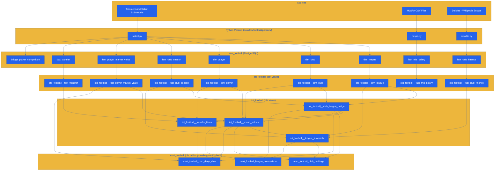

# ⚽ Football Analytics

-0d9488?logoColor=white)


> Global football market intelligence — squad valuations, transfer flows, club financials, and salary data across **7 top leagues**.

← [Back to root README](../../README.md)

---

## 📋 Overview

The Football domain analyses football club economics across 7 elite divisions. The primary analytical lens is **squad market value** (Transfermarkt) with secondary layers of **revenue data** (Deloitte, top 30 clubs only) and **MLS salary transparency** (MLSPA).

**Narrative focus:** Flamengo and the global rise of South American clubs as value-creation engines.

| League | ID | Country | Clubs |
|--------|----|---------|:-----:|
| Premier League | GB1 | England | 20 |
| La Liga | ES1 | Spain | 20 |
| Bundesliga | L1 | Germany | 18 |
| Serie A | IT1 | Italy | 20 |
| Ligue 1 | FR1 | France | 18 |
| Brasileirão | BRA1 | Brazil | 20 |
| MLS | MLS1 | USA / Canada | 29 |

---

## 🔄 Data Sources

| Source | Format | Parser | What It Provides |
|--------|--------|--------|-----------------|
| **Transfermarkt** (via [Salimt](https://github.com/dcaribou/transfermarkt-datasets)) | Git submodule (CSV/Parquet) | `salimt.py` | Clubs, players, transfers, market value snapshots, season performance |
| **MLSPA** | CSV (manual placement) | `mlspa.py` | MLS player salary data (salary + guaranteed compensation) |
| **Deloitte Money League** | Wikipedia scrape (cached HTML) | `deloitte.py` | Annual club revenue for Deloitte top-30 clubs |

> **Transfermarkt submodule:** Run `git submodule update --init --recursive` to initialise `data/raw/football/salimt/`.
> See `data/raw/football/SOURCES.md` for complete source documentation, URLs, and update frequency.

---

## 🗺️ Pipeline Flow



---

## 🗄️ Raw Tables Inventory

<details>
<summary>Expand raw_football table details (9 tables)</summary>

| Table | Key Columns | Purpose |
|-------|-------------|---------|
| `dim_league` | `league_id` (GB1/ES1/L1/IT1/FR1/BRA1/MLS1), `name`, `country` | League dimension — 7 in-scope leagues |
| `dim_club` | `club_id`, `club_name`, `country`, `club_slug`, `logo_url`, `source_url` | Club dimension from Transfermarkt |
| `dim_player` | `player_id`, `name`, `position`, `date_of_birth`, `nationality`, `foot` | Player dimension from Transfermarkt |
| `bridge_player_competition` | `player_id`, `club_id`, `league_id`, `season`, `appearances`, `goals`, `assists` | Player-season performance bridge |
| `fact_club_season` | `club_id`, `league_id`, `season`, `position`, `matches_played`, `wins`, `draws`, `losses`, `goals_for`, `goals_against`, `points` | Club season results from Transfermarkt |
| `fact_player_market_value` | `player_id`, `club_id`, `value_eur`, `market_value_date`, `season` | Player market value snapshots |
| `fact_transfer` | `player_id`, `from_club_id`, `to_club_id`, `transfer_date`, `fee_eur`, `is_loan`, `season` | Transfer records (fees, loans, free transfers) |
| `fact_mls_salary` | `player_id`, `club_id`, `season`, `base_salary_usd`, `guaranteed_comp_usd`, `position` | MLSPA salary disclosures for MLS players |
| `fact_club_finance` | `club_id`, `club_name`, `season`, `revenue_eur`, `operating_profit_eur` | Deloitte Money League revenue data (top 30 clubs only) |

</details>

---

## 📊 dbt Model Inventory

<details>
<summary>Staging layer — 8 models (stg_football schema, views)</summary>

| Model | Source Table | Purpose |
|-------|-------------|---------|
| `stg_football__dim_league` | `dim_league` | League dimension, typed and filtered to 7 in-scope IDs |
| `stg_football__dim_club` | `dim_club` | Club dimension with slug and URL fields |
| `stg_football__dim_player` | `dim_player` | Player dimension — name, position, nationality |
| `stg_football__fact_club_season` | `fact_club_season` | Season results, scoped to in-scope leagues |
| `stg_football__fact_player_market_value` | `fact_player_market_value` | Player valuations, EUR-denominated |
| `stg_football__fact_transfer` | `fact_transfer` | Transfer events with loan flag |
| `stg_football__fact_mls_salary` | `fact_mls_salary` | MLS player salaries in USD |
| `stg_football__fact_club_finance` | `fact_club_finance` | Deloitte revenue data, EUR-denominated |

</details>

<details>
<summary>Intermediate layer — 4 models (int_football schema, views)</summary>

| Model | Purpose | Key Logic |
|-------|---------|-----------|
| `int_football__club_league_bridge` | Resolves NULL `league_id` gaps in Transfermarkt data | Derives club-league association from `fact_club_season`; handles multi-league clubs |
| `int_football__squad_values` | Squad market value calculations | Aggregates player valuations per club per season; produces squad total, avg, and percentile breakdowns |
| `int_football__league_financials` | League-level financial aggregations | Joins squad values + Deloitte revenue + season results at league grain |
| `int_football__transfer_flows` | Transfer network flows | Net spend, incoming/outgoing fees, loan ratios per club per season |

</details>

<details>
<summary>Mart layer — 3 tables (mart_football schema, materialized)</summary>

| Mart | Grain | Description |
|------|-------|-------------|
| `mart_football_club_rankings` | club × season | Club rankings table: squad market value, league position, revenue, transfer net spend. Primary ranking surface for the webapp. |
| `mart_football_club_deep_dive` | club × season | Per-club deep dive: squad composition, top player valuations, transfer history, salary data for MLS clubs |
| `mart_football_league_comparison` | league × season | Cross-league comparison: total squad value, average club value, revenue aggregates, transfer activity by league |

</details>

---

## 📖 Data Dictionary (Key Marts)

<details>
<summary>mart_football_club_rankings — primary ranking surface</summary>

| Column | Type | Description |
|--------|------|-------------|
| `club_id` | varchar | Transfermarkt club identifier |
| `club_name` | varchar | Club name |
| `league_id` | varchar | League identifier (GB1, ES1, L1, IT1, FR1, BRA1, MLS1) |
| `season` | integer | Season year |
| `squad_market_value_eur` | numeric | Total squad market value in EUR |
| `avg_player_value_eur` | numeric | Average player market value in EUR |
| `league_position` | integer | Final league position |
| `points` | integer | Season points |
| `revenue_eur` | integer | Deloitte annual revenue (top 30 clubs only, NULL otherwise) |
| `transfer_net_eur` | numeric | Net transfer spend (incoming - outgoing fees) |

</details>

<details>
<summary>mart_football_league_comparison — cross-league metrics</summary>

| Column | Type | Description |
|--------|------|-------------|
| `league_id` | varchar | League identifier |
| `league_name` | varchar | Full league name |
| `season` | integer | Season year |
| `total_squad_value_eur` | numeric | Sum of all squad values in league |
| `avg_squad_value_eur` | numeric | Average squad value across clubs |
| `median_squad_value_eur` | numeric | Median squad value |
| `total_revenue_eur` | numeric | Deloitte revenue aggregate (where available) |
| `total_transfer_spending_eur` | numeric | League-wide incoming transfer fees |
| `club_count` | integer | Number of clubs in dataset |

</details>

---

## 🎯 Scope & Constraints

| Constraint | Detail |
|------------|--------|
| **In-scope leagues** | GB1, ES1, L1, IT1, FR1, BRA1, MLS1 — other leagues filtered at staging |
| **Revenue coverage** | Deloitte data covers only top-30 revenue clubs globally; most clubs have NULL revenue |
| **Salary data** | MLSPA salary disclosures for MLS players only; European salaries not in scope |
| **Market value source** | Transfermarkt community valuations — not official club figures |
| **Date coverage** | Transfermarkt data: 2000–present; Deloitte: varies by club (2010+); MLSPA: 2007+ |
| **NULL league_id gaps** | Transfermarkt data has clubs with NULL `league_id` — resolved via `int_football__club_league_bridge` |

> **Narrative focus:** Flamengo (BRA1) is the analytical protagonist — demonstrating how South American clubs compete on squad value with top European clubs despite revenue asymmetry.

---

## 🔄 ETL Entry Points

```bash
# Full football pipeline (includes dbt-run)
make load-football

# Load raw data only (no dbt)
make load-football-only

# Initialise Transfermarkt submodule (first time)
git submodule update --init --recursive
```

**ETL orchestrator**: `scripts/data/load_football_data.py`

**Data sources that require manual steps:**

| Source | Action Required |
|--------|----------------|
| Transfermarkt (Salimt) | `git submodule update --init --recursive` |
| MLSPA | Place CSV files in `data/raw/football/mlspa/` |
| Deloitte | Auto-fetched on first run; cached at `data/raw/football/deloitte/wikipedia_cache.html` |

---

## 🧪 Testing Coverage

```bash
make dbt-test   # Run all dbt tests
make test       # Run pytest unit tests
```

| Test Type | Scope |
|-----------|-------|
| dbt not_null | `club_id`, `league_id`, `season`, `squad_market_value_eur` in marts |
| dbt unique | (club_id, season) grain in rankings mart |
| dbt accepted_values | `league_id` in staging (7 valid IDs) |
| dbt relationships | club FK in all fact tables → `dim_club` |
| pytest unit | Parser logic (salimt CSV parsing, MLSPA parsing, Deloitte Wikipedia scrape) |

---

## ⚠️ Known Challenges

| Challenge | Status | Detail |
|-----------|:------:|--------|
| Transfermarkt NULL league_id | ✅ Resolved | `int_football__club_league_bridge` derives associations from season data |
| Deloitte revenue gaps | 🔄 By Design | Coverage limited to top-30 clubs globally; most clubs have NULL revenue |
| Currency mismatch (USD ↔ EUR) | 🔄 By Design | MLS salaries in USD; Deloitte revenue in EUR; market values in EUR. No FX conversion applied. |
| Season year convention | 🔄 By Design | European leagues use start-year (2023 = 2023/24); MLS uses calendar year |

---

## 🔗 References

| Resource | Link |
|----------|------|
| Root README | [../../README.md](../../README.md) |
| Toronto domain | [../toronto/README.md](../toronto/README.md) |
| Football data sources | [../../data/raw/football/SOURCES.md](../../data/raw/football/SOURCES.md) |
| Database schema reference | [../DATABASE_SCHEMA.md](../DATABASE_SCHEMA.md) |
| Adding a domain | [../runbooks/adding-domain.md](../runbooks/adding-domain.md) |

---

*Football domain · raw_football / mart_football schemas · 7 leagues · Updated February 2026*
