# 🛠️ Adding a New Data Domain

This runbook covers the full process for onboarding a new analytical domain into the `app-personal-portfolio-dataflow` pipeline. A domain is a complete ETL stack with its own database schema, Python package, and dbt model layer.

> **Scope:** This runbook covers the **dataflow repo only** — raw ingestion through mart tables. Once mart tables are deployed, webapp integration is a separate workflow documented in the `app-personal-portfolio` repo.

← [Back to root README](../../README.md) | [CONTRIBUTING.md](../../CONTRIBUTING.md)

---

## 📋 Prerequisites

Before starting, confirm:

- [ ] New domain has a clear analytical purpose and named data source(s)
- [ ] Source data is accessible (API key obtained, CSV files available, scrape strategy confirmed)
- [ ] Schema naming follows the convention: `raw_<domain>`, `stg_<domain>`, `int_<domain>`, `mart_<domain>`
- [ ] You're on a feature branch from `development`

---

## 🗺️ Domain Creation Flow

```mermaid
%%{init: {'theme': 'base', 'themeVariables': {'primaryColor': '#2563eb', 'primaryTextColor': '#fff', 'lineColor': '#64748b', 'secondaryColor': '#f1f5f9'}}}%%
flowchart LR
    A[1. Python Package] --> B[2. Pydantic Schemas]
    B --> C[3. SQLAlchemy Models]
    C --> D[4. Parsers]
    D --> E[5. Loaders]
    E --> F[6. dbt Models]
    F --> G[7. Tests + Docs]

    style A fill:#2563eb,color:#fff
    style B fill:#2563eb,color:#fff
    style C fill:#2563eb,color:#fff
    style D fill:#0d9488,color:#fff
    style E fill:#0d9488,color:#fff
    style F fill:#FF694B,color:#fff
    style G fill:#22c55e,color:#fff
```



---

## 🏗️ Step 1 — Create the Python Package

```bash
mkdir -p dataflow/<domain>/{parsers,schemas,models,loaders}
touch dataflow/<domain>/__init__.py
touch dataflow/<domain>/parsers/__init__.py
touch dataflow/<domain>/schemas/__init__.py
touch dataflow/<domain>/models/__init__.py
touch dataflow/<domain>/loaders/__init__.py
```

### Naming Conventions

| Layer | Pattern | Example |
|-------|---------|---------|
| Raw schema | `raw_<domain>` | `raw_energy` |
| Staging schema | `stg_<domain>` | `stg_energy` |
| Intermediate schema | `int_<domain>` | `int_energy` |
| Mart schema | `mart_<domain>` | `mart_energy` |
| Raw tables | `dim_*`, `fact_*`, `bridge_*` | `fact_energy_prices` |
| Staging models | `stg_<domain>__<entity>` | `stg_energy__prices` |
| Intermediate models | `int_<domain>__<transform>` | `int_energy__annual_summary` |
| Mart tables | `mart_<domain>_<subject>` | `mart_energy_market_overview` |

---

## 🏗️ Step 2 — Define Pydantic Schemas

Create one schema file per logical entity in `dataflow/<domain>/schemas/`:

```python
# dataflow/energy/schemas/price.py
"""Pydantic validation models for energy price data."""

from pydantic import BaseModel, field_validator


class EnergyPriceRecord(BaseModel):
    region_id: int
    year: int
    source: str
    price_kwh: float | None = None

    @field_validator("year")
    @classmethod
    def validate_year(cls, v: int) -> int:
        if v < 2000:
            raise ValueError(f"Year {v} is out of range")
        return v
```

**Rules:**
- Return Pydantic models from all parsers — never raw dicts
- Normalize Unicode before string comparisons (see `_normalize_key()` in Toronto parsers for Statistics Canada XLSX)
- Use `Python 3.10+` union syntax (`float | None`, not `Optional[float]`)

---

## 🏗️ Step 3 — Define SQLAlchemy Models

Create table definitions in `dataflow/<domain>/models/`:

```python
# dataflow/energy/models/facts.py
"""SQLAlchemy ORM models for raw_energy schema."""

from sqlalchemy import Index, Integer, Numeric, String, UniqueConstraint
from sqlalchemy.orm import DeclarativeBase, Mapped, mapped_column


RAW_ENERGY_SCHEMA = "raw_energy"


class Base(DeclarativeBase):
    pass


class FactEnergyPrice(Base):
    __tablename__ = "fact_energy_prices"
    __table_args__ = (
        UniqueConstraint("region_id", "year", "source", name="uq_fact_energy_key"),
        Index("ix_fact_energy_region_year", "region_id", "year"),
        {"schema": RAW_ENERGY_SCHEMA},
    )

    id: Mapped[int] = mapped_column(Integer, primary_key=True, autoincrement=True)
    region_id: Mapped[int] = mapped_column(Integer, nullable=False)
    year: Mapped[int] = mapped_column(Integer, nullable=False)
    source: Mapped[str] = mapped_column(String(50), nullable=False)
    price_kwh: Mapped[float | None] = mapped_column(Numeric(10, 4), nullable=True)
```

**Rules:**
- Always use SQLAlchemy 2.0 `Mapped` + `mapped_column` style
- Always specify `schema=RAW_<DOMAIN>_SCHEMA` in `__table_args__`
- Include `UniqueConstraint` on the natural key columns
- Include composite index on frequently-joined columns

### Register the Schema

Add the new raw schema to `scripts/db/init_schema.py`:

```python
SCHEMAS_TO_CREATE = [
    "raw_toronto",
    "raw_football",
    "raw_energy",  # add this
    # dbt output schemas
    "stg_toronto",
    "stg_football",
    "stg_energy",
    "int_toronto",
    "int_football",
    "int_energy",
    "mart_toronto",
    "mart_football",
    "mart_energy",
]
```

---

## 🏗️ Step 4 — Write Parsers

Create one parser file per data source in `dataflow/<domain>/parsers/`:

```python
# dataflow/energy/parsers/energy_api.py
"""Parser for energy price API."""

import httpx

from ..schemas.price import EnergyPriceRecord


def fetch_energy_prices(api_url: str, api_key: str) -> list[EnergyPriceRecord]:
    """Fetch and validate energy price data.

    Args:
        api_url: API endpoint URL.
        api_key: API authentication key.

    Returns:
        List of validated Pydantic records.

    Raises:
        ParseError: If the API request fails or response is malformed.
    """
    response = httpx.get(api_url, headers={"Authorization": f"Bearer {api_key}"}, timeout=30)
    response.raise_for_status()

    raw = response.json()
    return [EnergyPriceRecord(**row) for row in raw["data"]]
```

**Rules:**
- Parser functions are **pure** — no DB calls, no side effects
- Raise `ParseError` (from `dataflow.errors.exceptions`) on failure
- Export from `parsers/__init__.py`

---

## 🏗️ Step 5 — Write Loaders

Create loader(s) in `dataflow/<domain>/loaders/`:

```python
# dataflow/energy/loaders/loaders.py
"""Loaders for raw_energy schema."""

from sqlalchemy.dialects.postgresql import insert

from ..models.facts import FactEnergyPrice
from ..schemas.price import EnergyPriceRecord
from dataflow.config import get_engine


def load_energy_prices(records: list[EnergyPriceRecord]) -> int:
    """Upsert energy price records into raw_energy.fact_energy_prices.

    Returns:
        Number of rows upserted.
    """
    rows = [
        {
            "region_id": r.region_id,
            "year": r.year,
            "source": r.source,
            "price_kwh": r.price_kwh,
        }
        for r in records
    ]

    engine = get_engine()
    with engine.begin() as conn:
        stmt = insert(FactEnergyPrice).values(rows)
        stmt = stmt.on_conflict_do_update(
            constraint="uq_fact_energy_key",
            set_={"price_kwh": stmt.excluded.price_kwh},
        )
        result = conn.execute(stmt)
        return result.rowcount
```

---

## 🏗️ Step 6 — Create the ETL Orchestrator

```python
# scripts/data/load_energy_data.py
"""Energy data ETL pipeline."""

import logging

from dataflow.energy.parsers.energy_api import fetch_energy_prices
from dataflow.energy.loaders.loaders import load_energy_prices

logger = logging.getLogger(__name__)

ENERGY_API_URL = "https://api.example.com/energy/prices"


class EnergyPipeline:
    def run(self) -> None:
        logger.info("Starting energy ETL pipeline...")
        self._load_prices()
        logger.info("Energy ETL complete.")

    def _load_prices(self) -> None:
        records = fetch_energy_prices(ENERGY_API_URL, api_key="...")
        count = load_energy_prices(records)
        logger.info(f"Loaded {count} energy price rows")


if __name__ == "__main__":
    EnergyPipeline().run()
```

Add a `Makefile` target:

```makefile
load-energy: ## Load energy data
	$(PYTHON) scripts/data/load_energy_data.py
```

---

## 🏗️ Step 7 — Create dbt Models

### 7a. Staging Model

```sql
-- dbt/models/staging/energy/stg_energy__prices.sql
with source as (
    select * from {{ source('raw_energy', 'fact_energy_prices') }}
),

renamed as (
    select
        region_id,
        year,
        source,
        price_kwh::numeric(10, 4)   as price_kwh
    from source
    where region_id is not null
)

select * from renamed
```

Register the source in `dbt/models/staging/energy/_sources.yml`:

```yaml
version: 2

sources:
  - name: raw_energy
    schema: raw_energy
    description: "Raw energy data from the energy pricing API"
    tables:
      - name: fact_energy_prices
        description: "Energy price records by region, year, and source"
```

Register column documentation in `dbt/models/staging/energy/_staging.yml`.

### 7b. Intermediate Model

```sql
-- dbt/models/intermediate/energy/int_energy__annual_summary.sql
with prices as (
    select * from {{ ref('stg_energy__prices') }}
),

annual as (
    select
        region_id,
        year,
        avg(price_kwh)     as avg_price_kwh,
        min(price_kwh)     as min_price_kwh,
        max(price_kwh)     as max_price_kwh,
        count(*)           as source_count
    from prices
    group by region_id, year
)

select * from annual
```

### 7c. Mart Model

```sql
-- dbt/models/marts/energy/mart_energy_market_overview.sql
{{
    config(
        materialized='table',
        indexes=[{'columns': ['region_id', 'year'], 'unique': True}]
    )
}}

with summary as (
    select * from {{ ref('int_energy__annual_summary') }}
)

select
    region_id,
    year,
    avg_price_kwh,
    min_price_kwh,
    max_price_kwh,
    source_count
from summary
```

Document in `dbt/models/marts/energy/_marts.yml`. Update `docs/DATABASE_SCHEMA.md`.

### Register dbt schemas in `dbt_project.yml`

```yaml
models:
  portfolio:
    staging:
      energy:
        +materialized: view
        +schema: stg_energy
    intermediate:
      energy:
        +materialized: view
        +schema: int_energy
    marts:
      energy:
        +materialized: table
        +schema: mart_energy
```

---

## 🏗️ Step 7d — Validate dbt

```bash
# Always validate before running
cd dbt && .venv/bin/dbt parse --profiles-dir .

# Run staging only first
cd dbt && .venv/bin/dbt run --profiles-dir . --select staging.energy+

# Then full domain
cd dbt && .venv/bin/dbt run --profiles-dir . --select staging.energy+ intermediate.energy+ marts.energy+

# Run tests
make dbt-test
```

---

## 🧪 Step 8 — Tests and Documentation

### pytest Unit Tests

Create `tests/test_energy/`:

```python
# tests/test_energy/test_parsers.py
def test_fetch_energy_prices_parses_valid_response():
    ...

def test_fetch_energy_prices_raises_on_api_error():
    ...
```

### Create Domain Documentation

```bash
mkdir -p docs/energy
# Create docs/energy/README.md following the same structure as:
# - docs/toronto/README.md
# - docs/football/README.md
```

At minimum, include:
- Data source catalog table
- Mermaid pipeline flow diagram
- Raw tables inventory
- dbt model inventory
- Key mart data dictionary
- Known data challenges

---

## ✅ Completion Checklist

Copy-paste this checklist into your PR description:

```
### New Domain: <domain-name>

#### Python Package
- [ ] `dataflow/<domain>/` package created with `__init__.py`
- [ ] Pydantic schemas defined in `schemas/`
- [ ] SQLAlchemy models defined in `models/` with correct `schema=` setting
- [ ] Parsers written in `parsers/` — pure functions, no DB calls
- [ ] Loaders written in `loaders/` — upsert-by-key pattern

#### Database
- [ ] New raw schema added to `scripts/db/init_schema.py`
- [ ] Dbt output schemas (stg_*, int_*, mart_*) added to `init_schema.py`
- [ ] `make db-init` runs without error
- [ ] `make load-<domain>` loads data successfully

#### dbt
- [ ] `dbt/dbt_project.yml` updated with new domain schemas
- [ ] Staging models created in `dbt/models/staging/<domain>/`
- [ ] `_sources.yml` registered for raw schema
- [ ] `_staging.yml` with column documentation
- [ ] Intermediate models created in `dbt/models/intermediate/<domain>/`
- [ ] `_intermediate.yml` with model documentation
- [ ] Mart models created in `dbt/models/marts/<domain>/`
- [ ] `_marts.yml` with column documentation and tests
- [ ] `dbt parse` passes without errors
- [ ] `dbt run` completes for all new models
- [ ] `dbt test` passes for all new tests

#### Documentation
- [ ] `docs/<domain>/README.md` created (sources, pipeline diagram, table inventory, data dictionary)
- [ ] `docs/DATABASE_SCHEMA.md` updated with new raw tables and mart tables
- [ ] Root `README.md` updated: domain table and schema table
- [ ] Makefile targets added for new ETL script
- [ ] `CHANGELOG.md` entry added

#### Quality
- [ ] `make ci` passes (lint + typecheck + test)
- [ ] PR opened to `development` branch
```

> **Webapp integration is separate.** Once this PR is merged and mart tables are deployed, coordinate with the `app-personal-portfolio` repo to add the new data via read-only queries. Do not mix webapp changes into this PR.

---

## 🔗 References

| Resource | Link |
|----------|------|
| Root README | [../../README.md](../../README.md) |
| Contributing guide | [../../CONTRIBUTING.md](../../CONTRIBUTING.md) |
| Toronto domain (reference implementation) | [../toronto/README.md](../toronto/README.md) |
| Football domain (reference implementation) | [../football/README.md](../football/README.md) |
| Database schema reference | [../DATABASE_SCHEMA.md](../DATABASE_SCHEMA.md) |

---

*Runbook: Adding a New Domain · app-personal-portfolio-dataflow · Updated February 2026*
