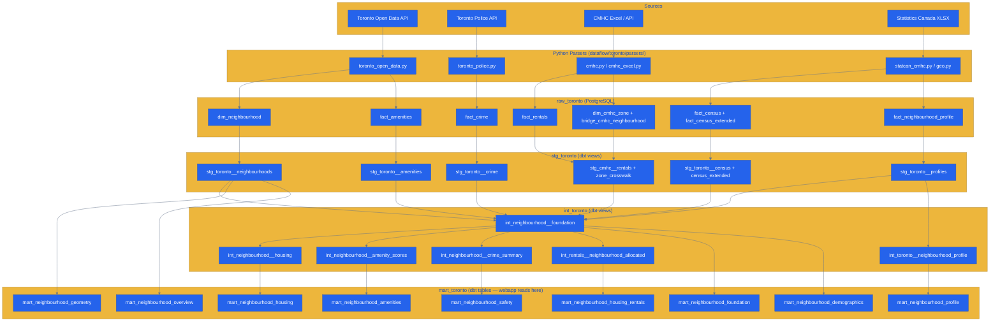

# 🏙️ Toronto Neighbourhood Analysis


> Comprehensive socioeconomic, housing, safety, amenity, and demographic intelligence across Toronto's **158 official neighbourhoods**.

← [Back to root README](../../README.md)

---

## 📋 Overview

The Toronto domain delivers neighbourhood-level analytics across five analytical dimensions: demographics, housing & rentals, safety, amenities, and community profiles. All data is keyed to Toronto's official 158-neighbourhood boundary system (City of Toronto 2021 definition, SRID 4326).

| Dimension | Source | Update Frequency |
|-----------|--------|:----------------:|
| Demographics & Census | Statistics Canada XLSX + Toronto Open Data | Census cycle (5-year) |
| Housing & Rentals | TRREB (PDF) + CMHC Rental Market Survey API | Annual |
| Safety | Toronto Police Service API | Annual |
| Amenities | Toronto Open Data Portal | Annual |
| Community Profiles | Statistics Canada XLSX (22 categories) | Census cycle (5-year) |

---

## 🔄 Data Sources

| Source | API / Format | Parser | What It Provides |
|--------|-------------|--------|-----------------|
| **Toronto Open Data** | REST API (GeoJSON/JSON) | `toronto_open_data.py` | Neighbourhood boundaries (PostGIS), census summaries, amenity counts |
| **Toronto Police Service** | REST API (JSON) | `toronto_police.py` | Crime statistics by neighbourhood and year |
| **CMHC Rental Market Survey** | Excel (XLSX) + Custom API | `cmhc.py`, `cmhc_excel.py`, `statcan_cmhc.py` | Rental vacancy rates, average rents, universe counts by zone and bedroom type |
| **Statistics Canada** | XLSX (neighbourhood profiles) | `geo.py`, `statcan_cmhc.py` | 55+ scalar census indicators; 22-category community profile (108k+ rows) |

---

## 🗺️ Pipeline Flow



---

## 🗄️ Raw Tables Inventory

<details>
<summary>Expand raw_toronto table details (10 tables)</summary>

| Table | Rows (approx.) | Key Columns | Purpose |
|-------|:--------------:|-------------|---------|
| `dim_neighbourhood` | 158 | `neighbourhood_id`, `name`, `geometry` (PostGIS), `population`, `land_area_sqkm`, `pop_density_per_sqkm`, `median_household_income`, `census_year` | Canonical neighbourhood reference with PostGIS boundaries |
| `dim_cmhc_zone` | ~50 | `zone_key`, `zone_name`, `city` | CMHC rental market zone definitions |
| `dim_policy_event` | varies | `event_id`, `event_date`, `policy_type`, `description` | Policy event annotations (future phase — manually curated) |
| `bridge_cmhc_neighbourhood` | ~200 | `zone_key`, `neighbourhood_id`, `overlap_pct`, `area_weight` | Area-weighted crosswalk between CMHC zones and neighbourhoods |
| `fact_amenities` | ~1,500 | `neighbourhood_id`, `amenity_type`, `count`, `year` | Amenity counts per neighbourhood (parks, schools, libraries, etc.) |
| `fact_census` | ~316 | `neighbourhood_id`, `census_year`, `population`, `population_density`, `median_household_income`, `average_household_income`, `unemployment_rate`, `pct_bachelors_or_higher`, `median_age`, `average_dwelling_value` | Core census scalar indicators |
| `fact_census_extended` | 158 | `neighbourhood_id`, `census_year` + 55 scalar columns | Extended Statistics Canada indicators (education detail, labour, immigration, language, housing quality, commuting) |
| `fact_crime` | ~5,000 | `neighbourhood_id`, `year`, `crime_type`, `count`, `rate_per_100k` | Crime statistics by type per neighbourhood |
| `fact_neighbourhood_profile` | 108,230+ | `neighbourhood_id`, `census_year`, `category`, `subcategory`, `count`, `category_total`, `indent_level` | Full 22-category XLSX community profile (hierarchical, 108k+ rows) |
| `fact_rentals` | ~4,000 | `date_key`, `zone_key`, `bedroom_type`, `avg_rent`, `vacancy_rate`, `turnover_rate`, `rent_change_pct`, `reliability_code` | CMHC annual rental market data by zone and bedroom type |

</details>

---

## 📊 dbt Model Inventory

<details>
<summary>Staging layer — 9 models (stg_toronto schema, views)</summary>

| Model | Source Table | Purpose |
|-------|-------------|---------|
| `stg_toronto__neighbourhoods` | `dim_neighbourhood` | Canonical neighbourhood reference — name, geometry, population |
| `stg_toronto__census` | `fact_census` | Core census scalar indicators, typed and renamed |
| `stg_toronto__census_extended` | `fact_census_extended` | 55 extended Statistics Canada scalar columns |
| `stg_toronto__profiles` | `fact_neighbourhood_profile` | 22-category XLSX profile with `category_total` and `indent_level` |
| `stg_toronto__crime` | `fact_crime` | Crime counts and rates by type |
| `stg_toronto__amenities` | `fact_amenities` | Amenity counts per neighbourhood |
| `stg_cmhc__rentals` | `fact_rentals` | CMHC rental metrics by zone and bedroom type |
| `stg_cmhc__zone_crosswalk` | `bridge_cmhc_neighbourhood` | Area-weighted CMHC zone → neighbourhood crosswalk |
| `stg_dimensions__cmhc_zones` | `dim_cmhc_zone` | CMHC zone dimension |

</details>

<details>
<summary>Intermediate layer — 11 models (int_toronto schema, views)</summary>

| Model | Purpose | Key Consumers |
|-------|---------|---------------|
| `int_neighbourhood__foundation` | **Central hub** — CPI imputation + 50+ extended scalars via LEFT JOIN. Base for all analytical marts. | housing, amenities, demographics marts |
| `int_neighbourhood__housing` | Housing metrics with dwelling / bedroom / construction period pivot CTEs | `mart_neighbourhood_housing` |
| `int_neighbourhood__amenity_scores` | Amenity accessibility scores + commute pivot CTEs + `car_dependency_index` | `mart_neighbourhood_amenities` |
| `int_neighbourhood__crime_summary` | Crime rate calculations aggregated by year | `mart_neighbourhood_safety` |
| `int_neighbourhood__demographics` | ⚠️ Soft-deprecated — reads from foundation; kept for backward compat | (deprecated, do not reference) |
| `int_rentals__annual` | Annual CMHC rental aggregations at zone grain | `int_rentals__neighbourhood_allocated` |
| `int_rentals__neighbourhood_allocated` | Area-weighted disaggregation of zone rentals → neighbourhood grain | `mart_neighbourhood_housing_rentals` |
| `int_rentals__toronto_cma` | Toronto CMA-level rental aggregates | (analytical reference) |
| `int_toronto__neighbourhood_profile` | Profile aggregations using `MAX(category_total)` denominator (bug-fix logic) | `mart_neighbourhood_profile` |
| `int_census__toronto_cma` | CMA-level census aggregates | (analytical reference) |
| `int_year_spine` | Year dimension helper | cross-domain joins |

</details>

<details>
<summary>Mart layer — 9 tables (mart_toronto schema, materialized)</summary>

| Mart | Grain | Description |
|------|-------|-------------|
| `mart_neighbourhood_geometry` | neighbourhood | ✅ **Geometry SSoT** — `neighbourhood_id`, `name`, `geometry`, `land_area_sqkm`. All spatial joins go here. |
| `mart_neighbourhood_overview` | neighbourhood | Composite livability scores, summary indicators |
| `mart_neighbourhood_foundation` | neighbourhood × year | 65+ scalar base (demographics, income, housing costs, labour, education) |
| `mart_neighbourhood_housing` | neighbourhood × year | 75+ housing columns: dwelling pivots, bedroom pivots, construction period pivots, shelter costs, fit scores |
| `mart_neighbourhood_housing_rentals` | neighbourhood × bedroom × year | CMHC rentals disaggregated to neighbourhood grain (4,424 rows) |
| `mart_neighbourhood_demographics` | neighbourhood × year | Population, income, age, education, diversity indices, profile summary |
| `mart_neighbourhood_safety` | neighbourhood × year | Crime counts and rates by type |
| `mart_neighbourhood_amenities` | neighbourhood | Amenity scores, commute pivots (6 modes, 5 durations, 4 destinations), `car_dependency_index` |
| `mart_neighbourhood_profile` | neighbourhood × category × subcategory | Full 22-category community profile with `indent_level`, `category_total`, `is_subtotal` |

</details>

---

## 📖 Data Dictionary (Key Marts)

<details>
<summary>mart_neighbourhood_geometry — geometry lookup (158 rows)</summary>

> **Design rule:** No analytical mart embeds geometry directly. All spatial lookups JOIN here via `neighbourhood_id`.

| Column | Type | Description |
|--------|------|-------------|
| `neighbourhood_id` | integer (PK) | Toronto official neighbourhood ID |
| `name` | varchar | Official neighbourhood name |
| `geometry` | geometry (PostGIS) | Polygon boundary, SRID 4326 |
| `land_area_sqkm` | numeric | Land area in km² |

</details>

<details>
<summary>mart_neighbourhood_foundation — base analytical table</summary>

| Column Group | Key Columns | Source |
|-------------|-------------|--------|
| Identity | `neighbourhood_id`, `year` | dim_neighbourhood |
| Population | `population`, `population_density`, `median_age` | fact_census |
| Income | `median_household_income`, `average_household_income` (CPI-imputed for 2016) | fact_census |
| Housing costs | `average_dwelling_value`, `shelter_cost_*` | fact_census_extended |
| Labour | `unemployment_rate`, `participation_rate`, `employment_rate` | fact_census_extended |
| Education | `pct_bachelors_or_higher`, `pct_high_school_only`, `pct_no_certificate` | fact_census + census_extended |
| Diversity | `pct_visible_minority`, `pct_indigenous`, `pct_immigrants` | fact_census_extended |
| Language | `pct_english_only`, `pct_french_only`, `pct_other_language` | fact_census_extended |

</details>

<details>
<summary>mart_neighbourhood_profile — 22 profile categories</summary>

| Category | Description |
|----------|-------------|
| `age` | Age group distribution |
| `household_size` | Household composition |
| `marital_status` | Marital status breakdown |
| `housing_tenure` | Owner vs. renter |
| `immigration` | Immigration status and period |
| `language` | Mother tongue and home language |
| `ethnic_origin` | Ethnic origin (200+ groups) |
| `education_level` | Highest certificate attained |
| `field_of_study` | Field of study for graduates (15+) |
| `occupation` | Occupation classification _(deferred)_ |
| `commute_mode` | Mode of transportation to work |
| `commute_duration` | Commute time brackets |
| `commute_destination` | Work destination (city/suburb/home) |
| `religion` | Religious affiliation |
| `dwelling_type` | Type of dwelling |
| `bedrooms` | Bedroom count distribution |
| `construction_period` | Period of construction |
| `housing_suitability` | Shelter space adequacy |
| `mother_tongue` | Mother tongue language |
| `indigenous_identity` | First Nations / Métis / Inuit identity |
| `income_bracket` | Income distribution _(deferred)_ |
| `family_type` | Family structure _(deferred)_ |

</details>

---

## 🔄 ETL Entry Points

```bash
# Full Toronto pipeline (includes dbt-run)
make load-toronto

# Load raw data only (no dbt)
make load-toronto-only

# dbt transformation only
make dbt-run

# Validate output
make dbt-test
```

**ETL orchestrator**: `scripts/data/load_toronto_data.py` — `DataPipeline` class with ordered steps:

1. `_load_dimensions()` — neighbourhood boundaries + CMHC zones
2. `_load_census()` — core census scalars
3. `_load_census_extended()` — 55 extended indicators
4. `_load_profiles()` — 22-category XLSX community profiles
5. `_load_crime()` — Toronto Police crime statistics
6. `_load_amenities()` — city amenity counts
7. `_load_cmhc()` — CMHC rental data + zone crosswalk

---

## ⚠️ Known Data Challenges

| Challenge | Status | Detail |
|-----------|:------:|--------|
| TRREB/CMHC boundary misalignment | 🔄 Mitigated | CMHC zones ≠ Toronto neighbourhoods — resolved via area-weighted crosswalk in `bridge_cmhc_neighbourhood` |
| Census denominator inflation | ✅ Resolved | Sprint 13 fix: `MAX(category_total)` instead of `SUM(count)` prevents 1.5–2× over-counting |
| Smart quote normalization | ✅ Resolved | Statistics Canada XLSX uses U+2019 (`'`) — `_normalize_key()` normalizes before label matching |
| Historical boundary reconciliation (140→158) | ⏳ Deferred | Pre-2021 boundary system had 140 neighbourhoods; alignment not attempted for V1 |
| XLSX `field_of_study` duplicate sections | ✅ Resolved | Anchor scoped to 15+ population section to prevent rows from 25–64 section |
| Deferred profile categories (6) | ⏳ Deferred | `occupation`, `industry_sector`, `income_bracket`, `income_source`, `household_type`, `family_type` — wrong XLSX anchors, needs investigation |
| `dim_policy_event` | ⏳ Deferred | Table exists but requires manual data curation |
| dbt source freshness checks | ⏳ Deferred | Requires `updated_at` timestamp columns on raw tables |

---

## 🧪 Testing Coverage

```bash
make dbt-test   # Run all 126 dbt tests
make test       # Run pytest unit tests
```

| Test Type | Count | Scope |
|-----------|:-----:|-------|
| dbt not_null | ~40 | All primary keys and critical FK columns |
| dbt unique | ~20 | Unique constraints on mart grains |
| dbt accepted_values | ~15 | `category` column (22 accepted values), `bedroom_type`, `crime_type` |
| dbt relationships | ~25 | FK integrity (mart → `mart_neighbourhood_geometry`) |
| pytest unit | ~30 | Parser logic, schema validation, XLSX normalization |

---

## 🔗 References

| Resource | Link |
|----------|------|
| Root README | [../../README.md](../../README.md) |
| Football domain | [../football/README.md](../football/README.md) |
| Database schema reference | [../DATABASE_SCHEMA.md](../DATABASE_SCHEMA.md) |
| VPS deployment | [../deployment/vps-deployment.md](../deployment/vps-deployment.md) |
| Adding a domain | [../runbooks/adding-domain.md](../runbooks/adding-domain.md) |

---

*Toronto domain · raw_toronto / mart_toronto schemas · Updated February 2026*
